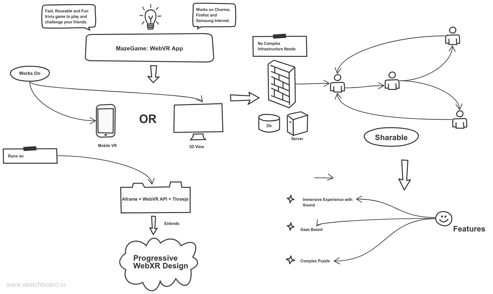

<div align=center>
  <h1>MazeGame</h1>
  <h2>WebVR Maze Game </h2>
  <b>An Aframe based Maze Game</b><br />
  <b> Version <i>Unreleased</i></b>
</div><br /><br />

##### Product : MazeGame 
##### Description : A sharable WebVR based game built on top of [Aframe](https://aframe.io) and [threejs](https://threejs.org/)
##### Status : Completed | Queued for Review 
##### Bug Reports  : 1 Major, 0 Minor detected
##### Live App : [Link](https://geekyshiva.github.io/MazeGame/index.html)

----

#### Product
  - Current Version : Unreleased
  - Current Status : Completed
  - Date : 05-07-2019

# Developer :

| [<br/><sub>Shivank Shekhar](https://github.com/GeekyShiva)<br/>|
| :---: |

# StoryBoard





# GamePlay Snip


# Product Description

<p align="left">
  <a href="https://travis-ci.org/aframevr/aframe"></a>

Maze Game has been built with the purpose to explore the intermingling of  WebVR [API](https://developer.mozilla.org/en-US/docs/Web/API/WebVR_API) and [Threejs](https://threejs.org/). 
<br> In order to explore this I decided to use [Aframe](https://aframe.io) for this project since Aframe. Since Aframe can be developed from a plain HTML file without having to install anything.
<br> A-Frame is a web framework for building virtual reality (VR) experiences. A-Frame is based on top of HTML, making it simple to get started. But A-Frame is not just a 3D scene graph or a markup language; the core is a powerful entity-component framework that provides a declarative, extensible, and composable structure to three.js.
<br> Due to my early days back exploration into Virtual Reality were using Aframe itself so I found this framework really interesting and powerful.

##### Features of Aframe

The following features of Aframe have been used in the development of this application.

1. Just dropping in a `<script>` tag and `<a-scene>`. A-Frame handles 3D boilerplate, VR setup, and default controls. Nothing to install, no build steps.
2. A-Frame's a powerful three.js framework, provides a declarative, composable, reusable entity-component structure to this code. HTML is just the tip of the iceberg; one can have unlimited access to JavaScript, DOM APIs, three.js, WebVR, and WebGL.
3. Many A-Frame’s core components such as geometries, materials, lights, animations, models, raycasters, shadows, positional audio, text, and controls for most major headsets have been used in the code to make it sharable and usable across many devices. 
4. Aframe provides the most lightweight VR applications.


# Application Features

The Maze Game application is loaded with cool features that one can use to enhance the game experience.

| Features | Usage|
| --- |---|
| Gaze | Components like Reload and Instruction, Universal Movement have gaze feature |
| Sound | Sound `<a-entity>` is to produce difficulty for the players     |
| Navigation| For Desktop Mode and VR Mode : Universal Controls have been provided |
| UI | All UI components follow the [**WebXR UI design guidlines**](https://blog.mozvr.com/progressive-webxr-ar-store/) and are mostly diegetic |
| DOF | **Maze Game has 3DOF** |

# Technical Details


### Builds 

Information about the aframe builds used can be found in the [libs](libs/aframe.js) and 
```
<!--Libraries & external scripts Import-->
    <script src="libs/aframe.js"></script>    <!--Aframe.js(v0.3.0) Library-->
    <script src="libs/aframe-extras.js"></script>    <!--Aframe-extras.js(v2.6.1) Library-->
    <script src="libs/aframe-text-component.min.js"></script>   <!--Aframe library used for rendering text-->
    <script src="libs/lz-string.min.js"></script>   <!--LZ-based compression algorithm for JavaScript-->
    <script src="libs/aframe-bmfont-text-component.js"></script>    <!--Aframe library used for rendering bitmap font text-->
    <script src="src/common.js"></script>    <!--JavaScript for the game-->
    <script src="https://cdn.jsdelivr.net/npm/aframe-glow@1.0.1/dist/aframe-glow-component.js"></script>

```
### File Structure 

Two main file components are necessary to run the application [index.html](index.html) and [common.js](common.js) which is the core logic file.

Other Important files in the code are 
1. [aframe.js](libs/aframe.js) - To include A-Frame in an HTML file, we drop a `<script>` tag pointing to the CDN build or we can download the JS build and add them to the code.
2. [aframe-bmfont-text-component.js](libs/aframe-bmfont-text-component.js) - This is a JS component useful for rendering bitmap and signed distance field font text in A-Frame. Basically, it wraps Matt DesLauriers' [three-bmfont-text](https://github.com/Jam3/three-bmfont-text) and [load-bmfont](https://github.com/Jam3/load-bmfont).
3. [aframe-extras.js](libs/aframe-extras.js) - These are Add-ons and helpers for A-Frame VR. Includes components for controls, model loaders, path-finding, and more.
4. [aframe-text-component.min.js](libs/aframe-text-component.min.js) - A text component for A-Frame. The text geometry component wraps THREE.TextGeometry.
5. [lz-string.min.js](libs/lz-string.min.js) - LZ-based compression algorithm for JavaScript 
> Warning (migrating from version 1.3.4 - nov 2014).Files have changed locations and name since a recent release. The new release file is in `libs/lz-string.min.js (or in libs/lz-string.js)` . Visit [lz-string](https://github.com/pieroxy/lz-string) for more details.

# Installation 

This installation section offers several ways to get started with A-Frame projects like this one, although most methods don’t require any actual installation since A-Frame is primarily HTML and JavaScript.

1. Download this code and [Remix on Glitch](https://glitch.com/) 
> You will need to change paths of assets since glitch does not allow assets to be put in extra folders.

Another way to Run the project on Glitch would be to fork it and open the project as a glitch project.

2.  You can use other online code editors to remix this project like : 
* [Mozilla Thimble](https://thimble.mozilla.org/en-GB/)
* [CodePen](codepen.io)

##### Local Deployment 

For using this game on your local machine follow the steps:

###### Local Server

We should develop projects using a local server so that files are properly served. Options of local servers include:

1. Downloading the [Mongoose](https://cesanta.com/) application and opening it from the same directory as your HTML file.
2. Running `python -m SimpleHTTPServer` (or `python -m http.server` for Python 3) in a terminal in the same directory as your HTML file.
3. Running `npm install -g live-server && live-server` in a terminal in the same directory as your HTML file.
4. Once we are running our server, we can open our project in the browser using the local URL and port which the server is running on (e.g., `http://localhost:8000`). Try not to open the project using the `file://` protocol which does not provide a domain; absolute and relative URLs may not work.
5. Clone the project using `git-clone URL` and run the `index.html` file.

# Test

| Browser        | Version          | Status  |
| ------------- |:-------------:| -----:|
| Chrome        | Desktop v75.0.3770.100 (64 bit) | Pass &#x2611; |
| Chrome Mobile     | Mobile v75.0.3770.101    |  Pass &#x2611; |
| Firefox Mobile | Mobile v67.0.3     |    Passed without Gyro |
| Firefox Quantum | Desktop v67.0.4 (64-bit)    |    Passed &#x2611; |
| Samsung Internet(on Galaxy s10) | Mobile v9.2.10.15    |    Passed &#x2611; |


# Bugs

There is one reported bug in this project (as tested across 5 different devices, both mobile and desktop)

**Jittering Screen** (On Mobile browsers only) : This issue is due to a hypersensitive gyroscope readings and because `DeviceMotionEvent.rotationRate` units have changed from degrees per second to radians on Chrome m66 

##### Resolution 

There has been a prolonged discussion on this [ISSUE](https://github.com/vizorvr/patches/issues/2100) and the only solution was to update to newest version of aframe.

_To resolve this issue, I tested the application heavily across `v.9.2,0.9.0,0.8.0,0.7.0,0.4.0` and related extras files but the problem still persist_

The issue has been raised at [Aframe Slack Channel](https://aframe.io/slack-invite/) and you can follow #issues and #questions to keep updated on the progress.

> This readme will be updated once the issue is resolved.

All other components are working fine as of today.

# Code Quality Report


# Credits 

Aframe Creator: [NGO Kevin @ngokevin](https://twitter.com/andgokevin) 

Special Thanks : [Diego Marcos @dmarcos](https://twitter.com/dmarcos)

